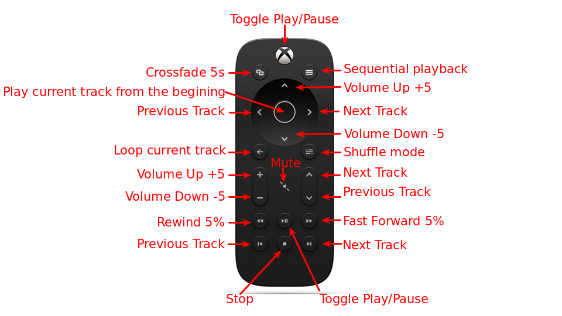

moninp
------
This tool maps Linux Input Device events into `mpc` commands that allow
you to control [mpd](https://www.musicpd.org/).

The whole code except the Key Press/Command mapping was written by [Ronium](http://unix.stackexchange.com/users/28489/runium)
You can find it on [Unix StackExchange](http://unix.stackexchange.com/a/94329)


I use this little program to control [Volumio](https://volumio.org/) with
[Xbox One Media Remote](http://www.xbox.com/en-GB/xbox-one/accessories/controllers/media-remote)


# Provided mapping

This project uses mapping for  which you can 
load into your Flirc USB.


Format: 

# Compile

You can build the binary with your own mappings by simply compiling the source
file with `gcc`.
```bash
gcc moninp.c -o monimp
```

PS. Volumio doesn't have `gcc` installed, so you can compile it on e.g.:
(Rasbian Jessie Lite](https://www.raspberrypi.org/downloads/raspbian/)


# Run:

```bash
sudo ./moninp /dev/input/event2
```

You can also provide device ID.
My [1st gen Flirc USB](https://flirc.tv/more/flirc-usb-v1) is identified as 
`/dev/input/by-id/usb-flirc.tv_flirc-event-kbd`. So you can start `moninp`
```bash
sudo ./moninp /dev/input/by-id/usb-flirc.tv_flirc-event-kbd
```

